# VoiceVibe — 7-day challenge (mục tiêu: 100% open source)

> Tên trước đây là **YupVox-Clone** (dự án lấy cảm hứng từ sản phẩm YupVox.com);
> hiện đã đổi thành **VoiceVibe**.

Clone của một SaaS AI voice/dubbing (TTS, STT, dubbing video/audio, dịch phụ đề,
tách & clone nhiều người nói, API developer) — dựng bằng stack open-source.

## Giao diện

> Ảnh chụp từ app đang chạy thật (headless Chrome/Playwright), **dữ liệu trong ảnh là
> demo seed cục bộ** (`creator@demo`) — không phải job thật.
> Chụp lại bất cứ lúc nào bằng `backend/scripts/ui_shot.py`.

### App UI — `/` (inline, chạy ngay không cần build step)

| Bảng điều khiển | Dub video/audio |
|---|---|
| 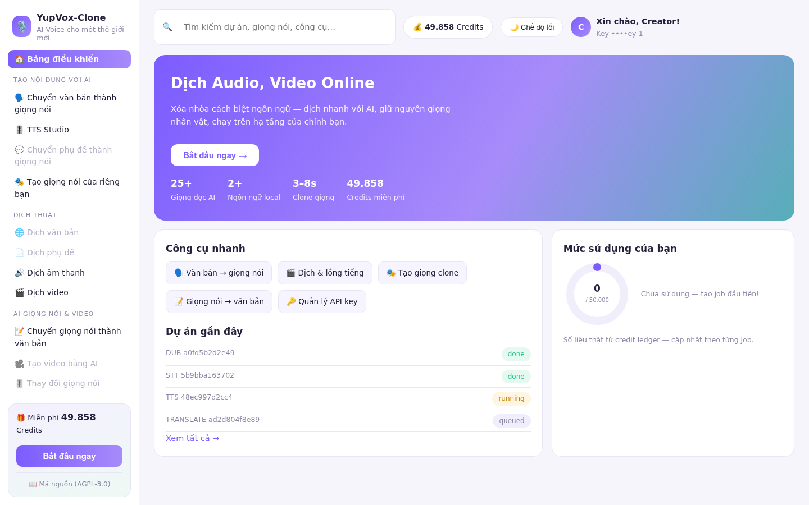 | 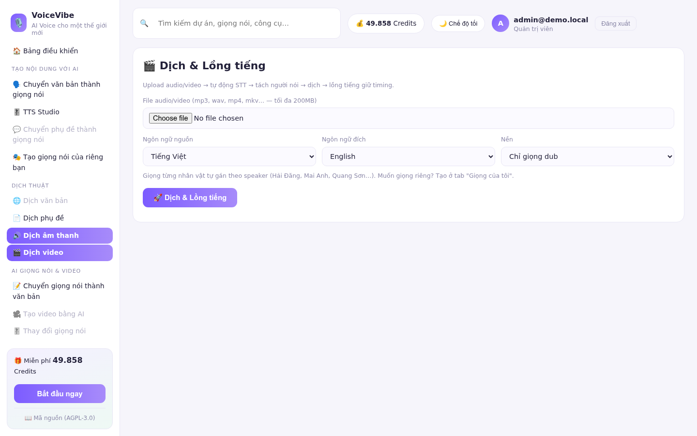 |

| Text → Speech | Giọng của tôi (voice clone) |
|---|---|
| 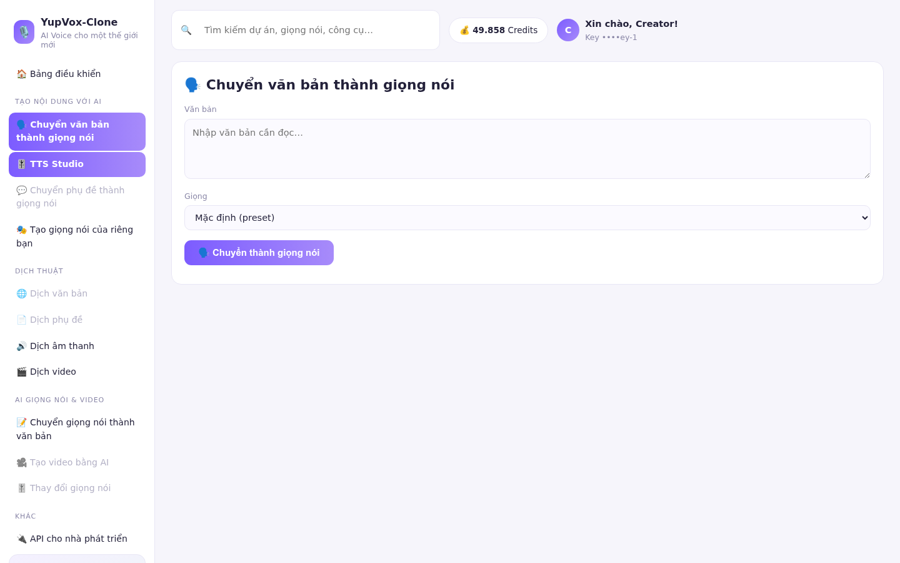 | 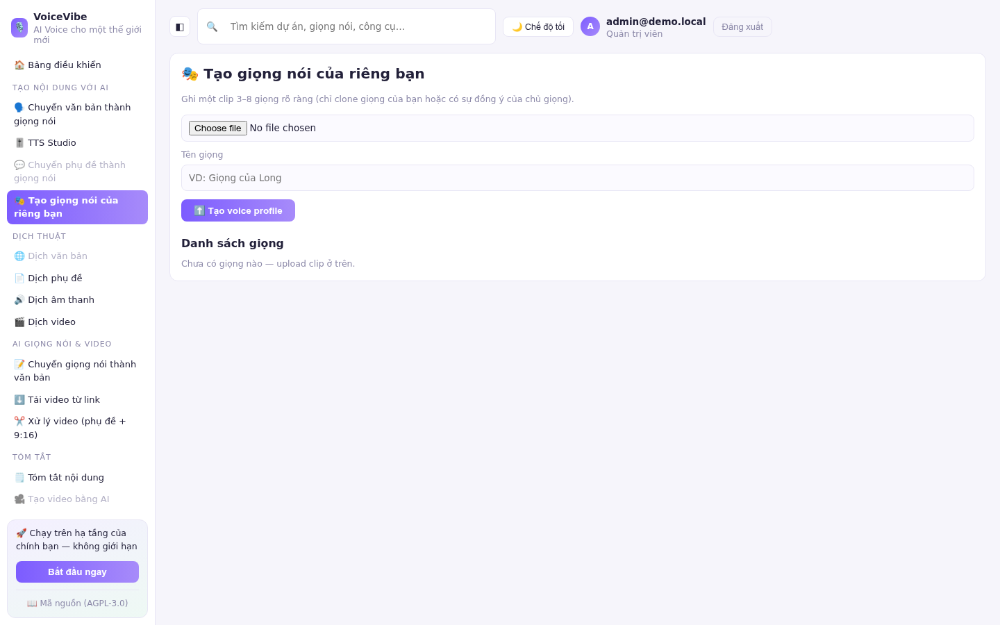 |

| Jobs (player inline) | API keys |
|---|---|
| 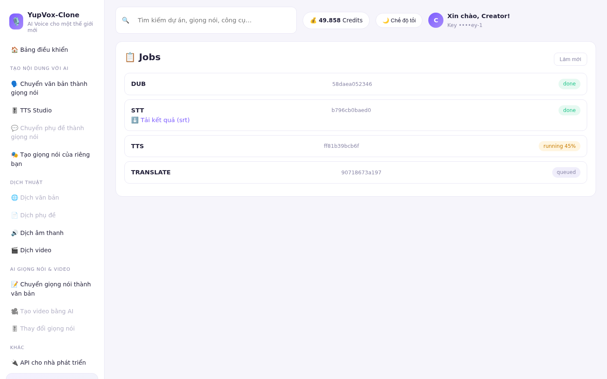 | 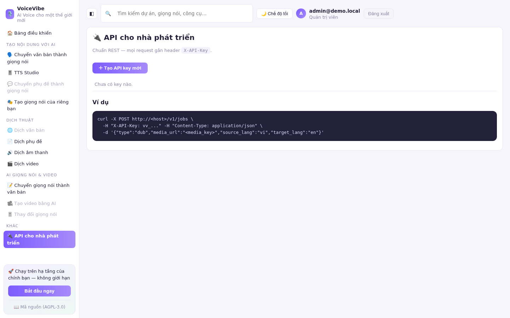 |

| Phụ đề (SRT/VTT/ASS + song ngữ) |
|---|
| 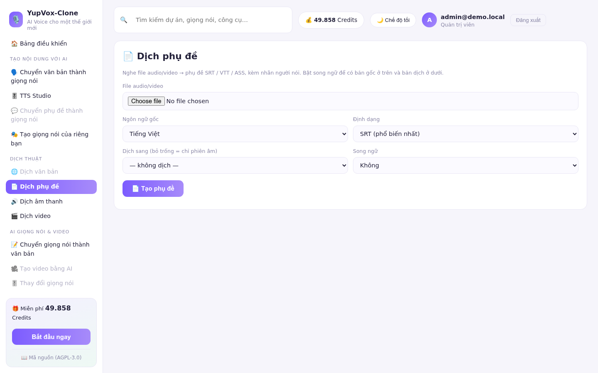 |

### SPA React — `frontend/` (bản UI tách riêng, cùng API)

Từ v0.4: giao diện React + Vite nằm ở `frontend/`, gọi đúng API `/v1/*` (cookie
phiên, CORS cấu hình qua `VOICEVIBE_CORS_ORIGINS` khi chạy khác origin). Prod qua
Caddy là **same-origin** — không cần CORS; image `web` (profile `proxy`) build
SPA ngay trong Docker rồi phục vụ cùng một domain với API:

```bash
docker compose --profile proxy build web
docker compose --profile proxy up -d
```

Dev: `cd frontend && npm install && VV_API_TARGET=http://127.0.0.1:8000 npm run dev`
(Vite proxy `/v1` + `/media` về backend — same-origin, không cần CORS).
Mock thuần UI (không cần backend): `VITE_USE_MOCK=1 npm run dev`.

| Dashboard | Dub (flagship) | AI Model Hub |
|---|---|---|
| 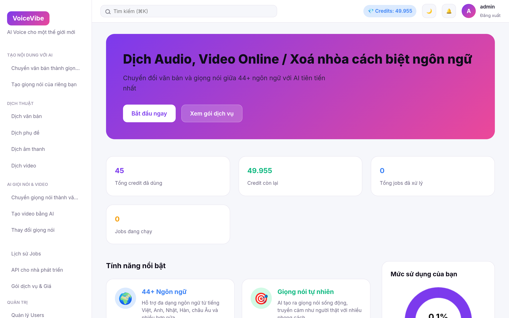 | 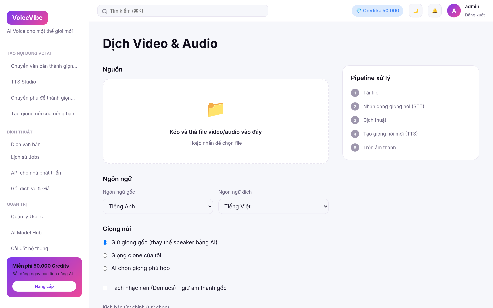 | 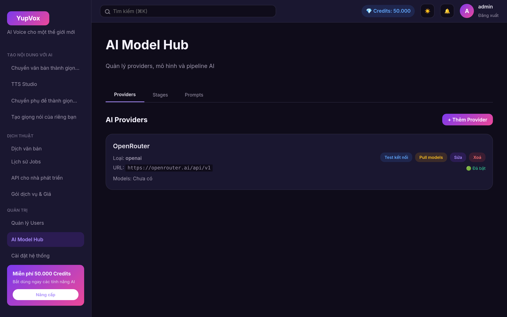 |

| Jobs | Settings Hub | Dashboard dark |
|---|---|---|
| 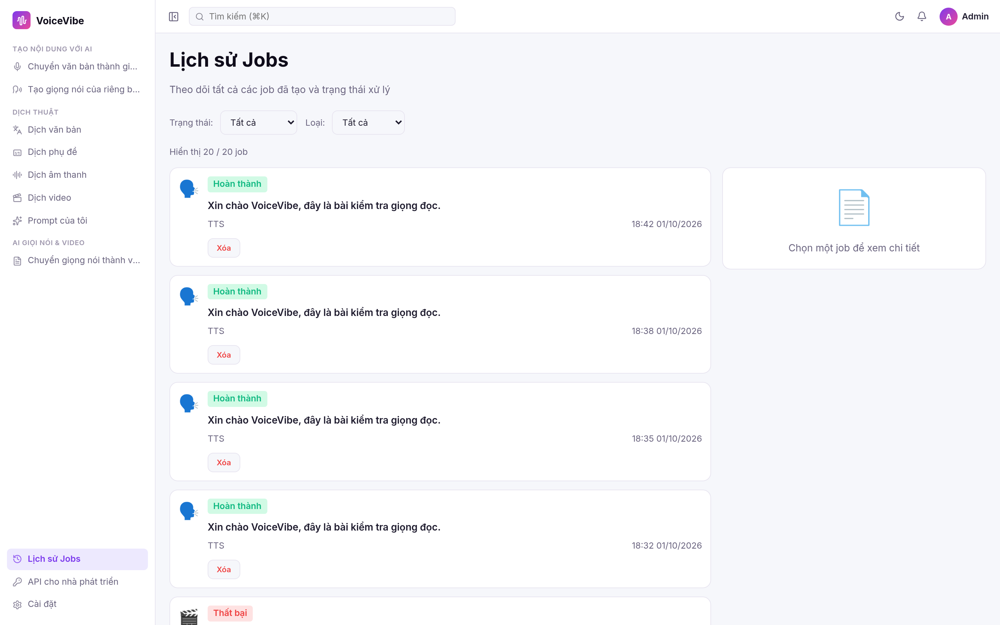 | 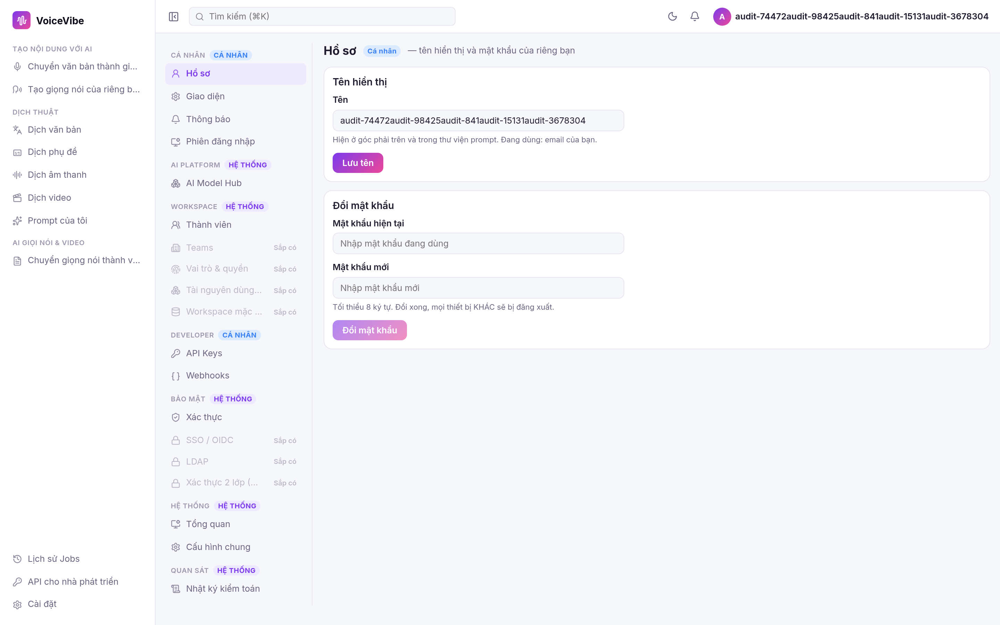 | 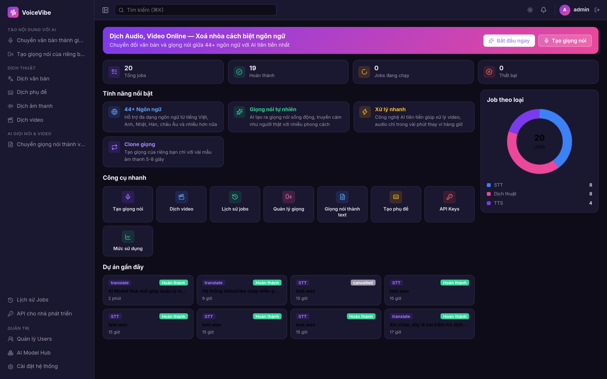 |

UI inline (HTML trong Python) **vẫn giữ nguyên** — bản self-host trỏ tunnel
thẳng vào `api:8000` không cần build gì vẫn dùng được toàn bộ tính năng.

### Phụ đề — SRT / VTT / ASS, kể cả song ngữ

Job `type=subtitle` nghe file audio/video rồi xuất phụ đề: STT + tách người nói,
nhãn người nói đọc được (`Người 1`, `Người 2` — không phải `SPEAKER_00`), và
tuỳ chọn **song ngữ** (bản gốc trên, bản dịch dưới).

```bash
curl -X POST $BASE/v1/jobs -H "X-API-Key: vv_…" -H 'Content-Type: application/json' \
  -d '{"type":"subtitle","media_url":"media/u1/…/talk.wav","source_lang":"vi",
       "target_lang":"en","format":"srt","bilingual":true}'
```

Ba định dạng có **ba quy ước thời gian khác nhau** — sai một dấu là phụ đề lệch
giờ mà nhìn file không thấy:

| | Thời gian | Ghi chú |
|---|---|---|
| `srt` | `00:00:01,500` | dấu **phẩy** thập phân |
| `vtt` | `00:00:01.500` | đầu file có `WEBVTT` |
| `ass` | `0:00:01.50` | **phần trăm** giây, không phải milli |

Vì vậy phần xuất dùng **pysubs2 (MIT)** thay vì tự nối chuỗi: nó đã xử lý đúng
quy ước từng định dạng, escape khối `{...}` của ASS, và `\N` cho xuống dòng cứng
(ASS coi `\n` là khoảng trắng nên song ngữ sẽ dồn thành một dòng nếu tự viết).

Kiểm chứng trên GPU thật: `docs/verification/subtitle.{srt,vtt,ass}` và
`subtitle-bilingual.*` sinh từ file mẫu 2 người nói — xem
`backend/scripts/subtitle_smoke.py`.

### Cài đặt — Settings Hub `/settings`

**Control Center cho cả người dùng lẫn quản trị viên**, phân nhóm theo **scope** (mỗi
nhóm gắn nhãn rõ setting nào chỉ tác động tới mình, setting nào tác động tới toàn
bộ instance self-hosted):

| Nhóm | Scope | Nội dung |
|---|---|---|
| **Cá nhân** | Cá nhân | Hồ sơ (tên hiển thị + đổi mật khẩu) · Giao diện · Thông báo · Phiên đăng nhập (thiết bị nào đang đăng nhập + đăng xuất từ xa) |
| **AI Platform** | Hệ thống | AI Model Hub (providers → models → capabilities → công đoạn) |
| **Workspace** | Hệ thống | Thành viên (tạo user, đặt lại mật khẩu, khoá/mở) · Teams/Vai trò: *sắp có* |
| **Developer** | Cá nhân | API Keys · Webhooks (khóa ký HMAC `X-VoiceVibe-Signature`) |
| **Bảo mật** | Hệ thống | Xác thực (đăng ký công khai, admin key) · SSO/LDAP/MFA: *sắp có* |
| **Hệ thống** | Hệ thống | Tổng quan (DB/queue/storage — chỉ đọc) · Cấu hình chung |
| **Quan sát** | Hệ thống | **Nhật ký kiểm toán** (audit log mọi hành động) · Tổng quan jobs toàn hệ |
| **Nâng cao** | Hệ thống | Công tắc tính năng · **Xuất/nhập cấu hình JSON** (không kèm secret) · Hướng dẫn sao lưu · Vùng nguy hiểm |

Mục *sắp có* hiển thị dạng mờ — không bấm được (không có menu chết). Route cũ
`/admin/users`, `/admin/model-hub`, `/admin/settings`, `/api-keys` **tự chuyển hướng**
về đúng section trong hub — link cũ không chết.

| Nhật ký kiểm toán (SPA) | Hồ sơ cá nhân (SPA) |
|---|---|
| 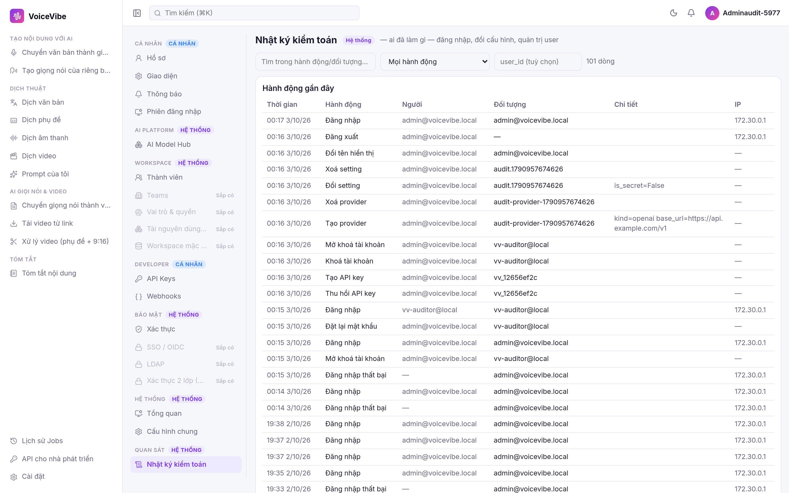 |  |

UI inline giữ tab **AI** · **Cấu hình** (kèm card Tình trạng hệ thống) · **Người dùng**
· **Nhật ký kiểm toán**; ứng dụng user có trang **Cài đặt** (hồ sơ/phiên/thông báo).

| AI — nhà cung cấp, công đoạn, prompt | Cấu hình hệ thống |
|---|---|
| 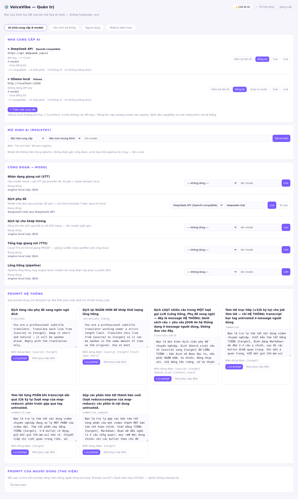 | 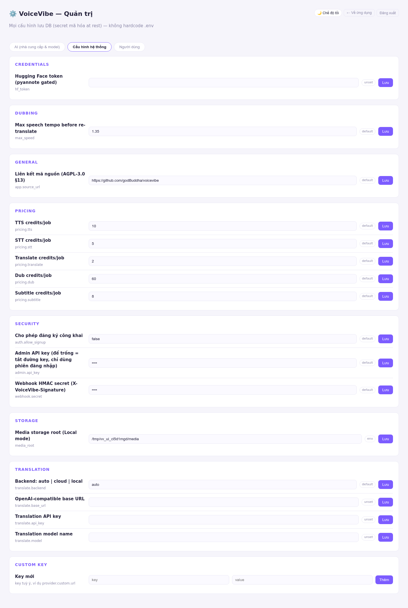 |

| Người dùng | Nhật ký kiểm toán (inline) |
|---|---|
| 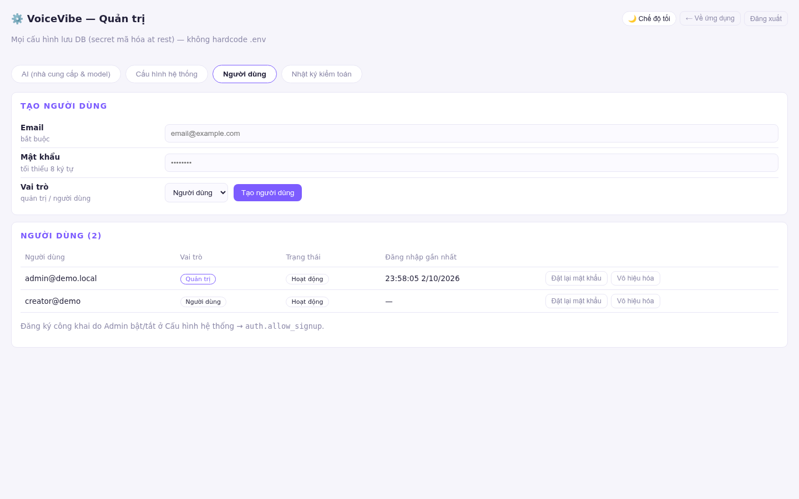 | 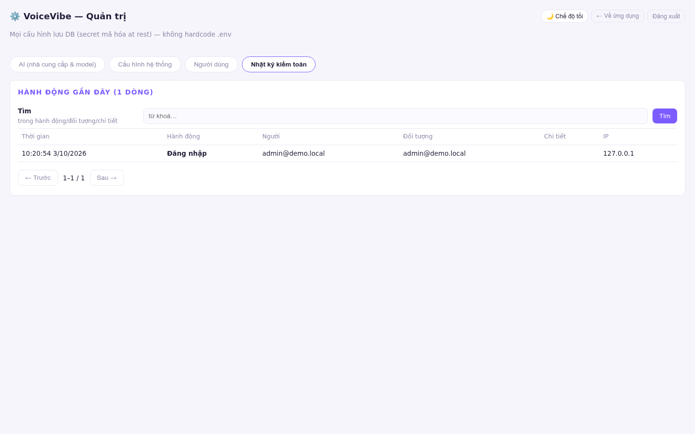 |

### Chế độ tối (dark mode)

Toàn bộ giao diện dùng chung một bộ token màu (`backend/app/theme.py`): chế độ sáng là
mặc định, chế độ tối lật ngay trên thanh trên cùng và được ghi nhớ trong `localStorage`
(`vv_theme`). Không có hex nào nằm ngoài khối token — `tests/test_theme.py` cưỡng chế điều này.

| Bảng điều khiển (tối) | Dub (tối) |
|---|---|
| 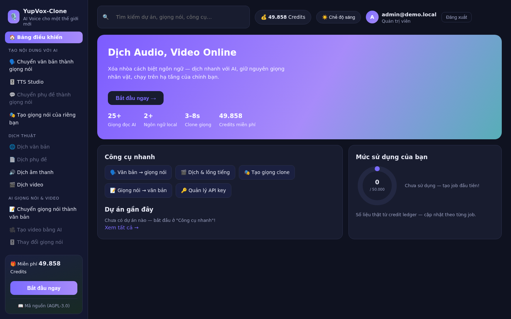 | 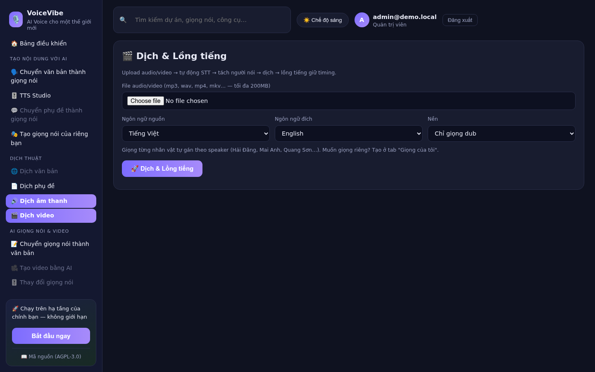 |

## Chọn model & phần cứng (local vs cloud)

Chức năng nào nên chạy trên **máy bạn**, chức năng nào nên **thuê mây** — bảng
quyết định nhanh, rà soát nhà cung cấp từng khâu (kèm giá thật), và đề xuất GPU
từ dòng RTX 2000: **[docs/models-and-hardware.md](docs/models-and-hardware.md)**.

> Tóm tắt: mây cho **dịch** (tùy chọn cả STT/TTS giá lẻ); 4 khâu **nhân bản
> giọng, phân biệt ai nói, tách nhạc nền, canh thời gian** bắt buộc chạy local —
> chuẩn API mây không bán khâu đó. Không có GPU vẫn chạy đủ 5 luồng (CPU mode).

## Kiểm thử & CI

Mọi push chạy **15 suite offline** trên GitHub Actions — không cần GPU, không tải model:
10 guard (`tests/test_*.py`) + 5 pipeline selftest. Bước chạy **không dừng ở suite đỏ đầu
tiên**: một lần chạy cho biết toàn cảnh, và mỗi lần chạy tự công bố bảng kết quả vào
`$GITHUB_STEP_SUMMARY`.

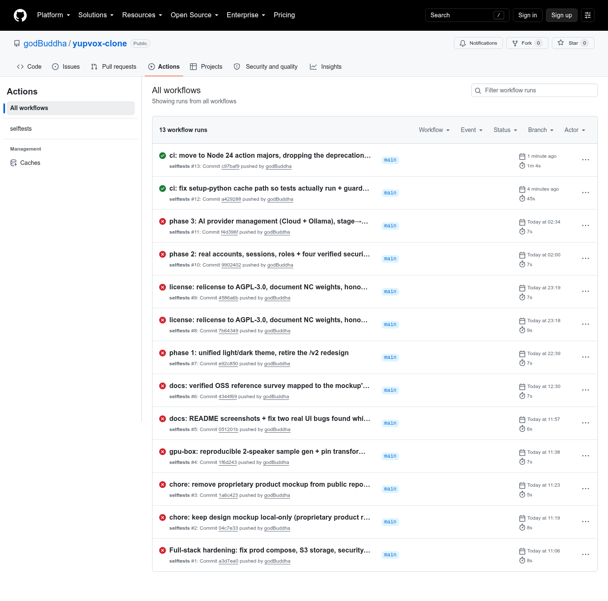

> **CI từng đỏ 11 lần liên tiếp mà không phải vì code.** Mọi lần chạy đều chết sau ~7 giây
> tại `actions/setup-python` vì khai `cache: pip` nhưng repo không có `requirements.txt`
> lẫn `pyproject.toml` (deps nằm ở `backend/requirements-api.txt` và
> `requirements-worker.txt`) — job dừng **trước khi chạy test nào**, nên "đỏ" không nói gì
> về chất lượng mã. Ảnh trên cho thấy đúng bước ngoặt: 11 lần 5–9s, rồi 45s / 1m4s / 40s
> sau khi sửa. Xem `backend/tests/test_ci_config.py` — guard canh chính file workflow
> (cache path phải trỏ tới file có thật, mọi suite được workflow gọi phải tồn tại, và
> không test nào bị bỏ quên ngoài CI). Guard đã được kiểm chứng **ngược**: gỡ dòng sửa ra
> thì nó fail, thêm lại thì pass.

Chạy tại chỗ, đúng những gì CI chạy:

```bash
cd backend
PYTHONPATH=. VOICEVIBE_INLINE=1 python tests/test_day2.py     # ... và 9 suite còn lại
python -m app.pipelines.dub_pipeline --selftest            # cần ffmpeg
```

Smoke UI thật (bắt lỗi JS mà test Python không thấy): `python backend/scripts/ui_shot.py --check`

## Kiểm chứng trên GPU (pipeline thật)

CI chạy offline nên **không** chạm tới model. Pipeline thật được kiểm bằng các smoke script
trên box GPU, chạy đúng mã của commit đã push:

| Script | Nội dung | Kết quả |
|---|---|---|
| `scripts/d5_smoke.py` | lồng tiếng vi→en audio 2 người nói: STT + tách người nói → dịch → TTS → timing-fit → ffmpeg; kiểm lại bằng ASR vòng | ✅ 14.3s / nguồn 13.8s, 37 từ en, `p=1.00` |
| `scripts/d7_smoke.py` | lồng tiếng **video**: MP4 vào → MP4 ra, giữ luồng hình, `background=source_low` | ✅ MP4 320×180 h264 + aac 48k, 13.7s, 37 từ en |
| `scripts/subtitle_smoke.py` | phụ đề SRT/VTT/ASS + song ngữ từ audio 2 người nói | ✅ 5 cue, 2 người nói, 3 định dạng |
| `scripts/migration_smoke.py` | DB **hình dạng cũ** → migrate, và `stage_translator()` phải trả `None` chứ không ném lỗi | ✅ 7/7 |
| `scripts/retranslate_llm_check.py` | vòng lặp re-translate với **LLM thật** (OpenRouter) | ✅ 5.3s @ tốc độ ép 1.35 → **2.4s @ 1.18** |

Nhật ký thô: `docs/verification/*.log`. Bằng chứng hình ảnh lấy **trực tiếp từ MP4 đã tạo**
(`ffmpeg` trích khung hình, không phải ảnh minh hoạ) — khung ở giây thứ 11 hiện đúng đồng hồ
đếm của `testsrc`, tức luồng video sống sót qua bước lồng tiếng. Ảnh dạng sóng nguồn và bản
đã lồng tiếng xếp đoạn khớp nhau, cho thấy timing-fit đặt đúng vị trí.

### Video demo thật — lồng tiếng Trung → Việt (2 phút 13 giây)

Video phim ngắn tiên hiệp AI từ YouTube (nguồn ghi dưới đây) chạy qua pipeline đầy đủ —
không phải sample tổng hợp. Kết quả tải được ngay trong repo:

| File | Nội dung |
|---|---|
| [`docs/samples/dub-demo-zh-original.mp4`](docs/samples/dub-demo-zh-original.mp4) | bản gốc — tiếng Trung, H.264/AAC 608×1080, 28 MB |
| [`docs/samples/dub-demo-vietnamese.mp4`](docs/samples/dub-demo-vietnamese.mp4) | **bản lồng tiếng Việt** — 33 câu, 6 nhân vật 6 giọng, nhạc nền giữ nguyên (Demucs), 27 MB |

Số liệu kiểm chứng (chạy trên RTX 3060, script `scripts/dub_video_a.py` + `dub_video_b.py`):

- STT nhận diện tiếng Trung `p=0.99`, 33 câu; diarization **6 người nói**
- Dịch qua DeepSeek v3.1 (OpenRouter): *"Thưa công tử, để thiếp hầu tắm. Mời công tử thay phục..."*
- Thời lượng ra 133,08s / gốc 133,12s (lệch 0,04s) — timing-fit giữ nhịp
- Kiểm chứng vòng: STT lại bản lồng → tiếng Việt `p=1.00`, 193 từ khớp nội dung
- Chạy **tái lập được trên 2 máy khác nhau** (2×3090 và RTX 3060) cho kết quả nhất quán

> Nguồn video test: [YouTube Shorts `ddrIihy7NRc`](https://youtube.com/shorts/ddrIihy7NRc)
> (kênh CineAIVideo, phim ngắn AI) — dùng làm sample demo, bản quyền thuộc tác giả gốc.

### Đoạn dịch dài quá thời lượng — không còn đọc méo

Khi bản dịch dài hơn slot, cách cũ là ép `atempo` tới `max_speed` (1.35) — nghe rõ méo.
Giờ pipeline **xin bản dịch ngắn hơn** (prompt `retranslate_timing`, sửa được trong `/admin`)
rồi tổng hợp lại. Ba điều đã kiểm chứng bằng LLM thật:

- **Ngân sách ký tự tính từ tốc độ nói thật** của chính bản dịch hiện tại, không phải hằng số.
- **Model KHÔNG tôn trọng `max_chars`**: xin ≤21 ký tự, `gpt-4o-mini` trả 45 rồi 33. Nên
  pipeline **đo trên audio tổng hợp**, chỉ nhận khi audio thật sự ngắn hơn — tin vào độ dài
  chuỗi là nhận một bản vẫn không vừa slot.
- **Model không tất định**: cùng prompt, hai lời gọi cho hai kết quả khác nhau.

### Chống Whisper "bịa" chữ

Whisper luôn phải sinh ký tự kể cả trên đoạn im lặng/nhạc, nên nó bịa — và trong pipeline
lồng tiếng, câu bịa bị **dịch rồi đọc lên**, tức là thêm nội dung không có trong bản gốc.
Lọc theo ba tín hiệu xác suất của chính model (`no_speech_prob`, `avg_logprob`,
`compression_ratio`) chứ **không dùng danh sách câu** — danh sách sẽ hụt mọi ngôn ngữ khác.
Hai điểm quan trọng: `no_speech` cao một mình **không đủ** (câu nói ngắn làm model phân vân
nhưng vẫn giải mã đúng — lọc theo nó sẽ ăn mất câu thật), và bộ lọc **không bao giờ trả về
rỗng** (mất hết nội dung tệ hơn giữ nhiễu). Số đoạn bị bỏ được ghi vào job và trả ra API để
người dùng kiểm tra được.

## Kiến trúc

```
Client / Web UI ──► FastAPI (api) ──► Celery queue (Redis) ──► AI Worker (GPU)
                        │                                           │
                        ├── Postgres: users, jobs, api_keys        │
                        └── MinIO (S3): media in/out ◄──────────────┘

AI Worker pipeline (dub):
  ffmpeg demux ─► faster-whisper (STT) ─► pyannote (diarization)
AI Worker pipeline (dub) — mỗi stage là provider hoán đổi được (app/providers/):
  stt        : local faster-whisper  | OpenAI-compatible /v1/audio/transcriptions
  diarize    : local pyannote        | (chuẩn OpenAI KHÔNG có speaker labels)
  translate  : local vLLM Qwen int4  | OpenAI-compatible /v1/chat/completions
  tts        : local VieNeu (clone)  | OpenAI-compatible /v1/audio/speech (preset)
  sync + mix : timing-fit engine + ffmpeg — local, core IP
```

## Provider layer — local-first, cloud-optional

Mỗi stage là một interface; local engine và endpoint cloud chuẩn OpenAI cài cùng
interface, hoán đổi qua config + fallback chain (lazy init — engine nặng chỉ nạp
khi được gọi, engine thiếu = fallback event thay vì boot failure).
Selftest: `PYTHONPATH=. python tests/test_providers.py`

| Stage | Chuẩn OpenAI? | Cloud | Local | Ghi chú |
|---|---|---|---|---|
| STT | ✅ /v1/audio/transcriptions | OpenAI, Groq… | faster-whisper | cloud cho spike, local cho batch |
| Diarization | ❌ | adapter riêng | pyannote | speaker labels không có trong chuẩn |
| Translate | ✅ /v1/chat/completions | OpenAI, DeepSeek, Groq, vLLM… | Qwen int4 | local mặc định, cloud fallback/quality |
| TTS preset | ✅ /v1/audio/speech | OpenAI, VieNeu server | VieNeu, Chatterbox | preset voices only |
| Voice cloning | ❌ | VieNeu API (proprietary), ElevenLabs (adapter) | VieNeu, Chatterbox | feature cốt lõi — bắt buộc local |
| Sync + mix | ❌ | — | ffmpeg + timing engine | core IP |

→ Hai tính năng định vị sản phẩm (clone giọng + tách người nói) KHÔNG có trong
chuẩn OpenAI: một clone "thuần cloud API" không thể tái tạo sản phẩm gốc. Kiến trúc
local-first là bắt buộc; cloud chỉ tùy chọn cho các stage hàng hóa.

### AI Model Hub — Model Registry (`/settings/ai-platform`)

Model được quản lý như **entity độc lập** (bảng `ai_models`, danh tính
`provider_id + model_id`) — không phải chuỗi text gắn trên provider:

1. **Đồng bộ** — pull catalog từ provider (OpenRouter/OpenAI-compatible: metadata
   modality + pricing + context; Ollama: `capabilities` từ /api/tags). Nhận diện
   capability CHỈ từ metadata chính thức — thiếu → `unknown`, không suy đoán theo tên.
2. **Đối chiếu** — 16 chức năng hệ thống (`app/capabilities.py`) khai capability
   bắt buộc; engine (`app/compat.py`) tính 4 trạng thái: Compatible / Một phần /
   Không rõ / Không tương thích.
3. **Bật/tắt từng model** — trạng thái riêng của registry, sync không ghi đè.
   Model tắt: không hiện trong selector, không được gán công đoạn, bị loại khỏi
   pipeline lúc chạy (đã kiểm `stage_chain`).
4. **Gán công đoạn** — selector lọc theo chức năng (vd stage translate chỉ gợi ý
   model đủ [text, chat]), nhóm Đề xuất / Compatible / Một phần; chuỗi fallback
   order>0 được runtime dùng thật (first-success-wins).

Quy tắc runtime: STT/TTS stage có model cloud → job gọi provider đó; giọng
CLONE luôn local (chuẩn OpenAI /audio/speech chỉ có preset); model bị provider
gỡ khỏi catalog bị XOÁ khỏi registry khi đồng bộ, kèm gỡ gán an toàn.

```yaml
# providers.yaml (ví dụ)
translation:
  - {provider: openai_chat, base_url: "https://api.deepseek.com/v1",
     api_key_env: DEEPSEEK_API_KEY, model: deepseek-chat}
  - {provider: openai_chat, base_url: "http://vllm:8000/v1",
     api_key: EMPTY, model: Qwen/Qwen3-4B-Instruct-2507}   # fallback local
tts_vi:
  - {provider: local_vieneu}                               # clone — local
  - {provider: openai_tts, base_url: "https://api.openai.com/v1",
     api_key_env: OPENAI_API_KEY, model: tts-1}            # fallback preset
```

Hybrid VRAM (gói 12GB): nếu dịch chạy cloud → trả lại ~4GB → all-resident
(whisper int8 + pyannote + VieNeu) ≈ 7GB, thoải mái.

## Stack & license

### License của dự án: AGPL-3.0

Dự án này là **phần mềm tự do, phi thương mại, phát hành theo GNU AGPL-3.0** (xem `LICENSE`).
Nói ngắn gọn: bạn được dùng, sửa, phát hành lại thoải mái — kể cả chạy như dịch vụ cho người
khác dùng — miễn là **giữ nguyên giấy phép và công bố mã nguồn** (AGPL §13 áp dụng cả khi chỉ
chạy trên server, không cần phân phối binary). Đúng tinh thần "mã nguồn mở 100% miễn phí".

> **Điều khoản 13 — đường dẫn mã nguồn:** vì đây là ứng dụng web, giao diện có sẵn liên kết
> **"Mã nguồn"** trỏ tới kho mã nguồn (góc dưới thanh bên). **Nếu bạn self-host và sửa code,
> hãy đổi liên kết đó sang bản của bạn** — đó là nghĩa vụ AGPL, không phải tuỳ chọn.

### ⚠️ Trọng số model non-commercial (CC-BY-NC) — không dùng thương mại

Dự án phi thương mại nên có thể dùng một số model có **weights CC-BY-NC** (cấm thương mại).
**Hạn chế này đi theo cả người self-host**: nếu bạn cài bản này, bạn cũng không được dùng nó
cho mục đích thương mại.

| Model | License weights | Ghi chú |
|---|---|---|
| `nguyenvulebinh/wav2vec2-base-vietnamese-250h` | **CC-BY-NC-4.0** | aligner tiếng Việt (buộc timing từng từ) |
| `facebook/mms-1b-fl102` (MMS_FA) | **CC-BY-NC-4.0** | phương án thay thế cho aligner |
| `SWivid/F5-TTS` | **CC-BY-NC-4.0** | TTS dự phòng (code MIT, weights NC) |
| `coqui/XTTS-v2` | **CPML** (cấm thương mại) | không dùng cho voice cloning thương mại |

Phần còn lại của stack đều permissive (Apache/MIT/BSD) — **dùng thương mại được**:

| Layer | Model / tool | License | Ghi chú |
|---|---|---|---|
| TTS tiếng Việt + clone | **VieNeu-TTS v3 Turbo** | Apache-2.0 | 48kHz, clone từ clip 3–8s, 25 giọng preset 3 miền, streaming OpenAI-compatible |
| TTS đa ngôn ngữ (non-vi) | Chatterbox | MIT | 23+ ngôn ngữ, không có tiếng Việt |
| TTS đa ngôn ngữ (thay thế) | CosyVoice | Apache-2.0 | 9 ngôn ngữ |
| STT | faster-whisper (large-v3) | MIT (weights Apache-2.0) | Whisper gốc MIT |
| STT tiếng Việt chuyên biệt | PhoWhisper (`VinAI/PhoWhisper-large`) | BSD-3 | weights tiếng Việt permissive duy nhất |
| Diarization | pyannote 3.1 | MIT code | HF gated — accept 4 repo: speaker-diarization-3.1, segmentation-3.0, wespeaker-voxceleb-resnet34-LM, speaker-diarization-community-1 |
| Translation | Qwen LLM local | Apache-2.0 | **Không dùng NLLB** (CC-BY-NC) |

⚠️ VieNeu **v4 là proprietary** (không open-source, chỉ qua API vieneu.io) — dùng v3 Turbo,
bản open-source mới nhất. Tính năng Dubbing/Lecture/TikTok của VieNeu chỉ có trong app
chính thức; repo chỉ cung cấp core SDK → pipeline dub (D5) là phần chúng ta tự viết.

## Tài liệu

- [`docs/oss-references.md`](docs/oss-references.md) — rà soát **mã nguồn OSS tham chiếu**
  cho từng tính năng (dubbing, TTS/clone, diarization, lip-sync, video AI, UI đa track…),
  **license đã xác minh bằng file LICENSE thật**, danh sách "không dùng" và lộ trình áp dụng.
  Vì dự án đã là **AGPL-3.0**, có thể copy code từ MIT/Apache/BSD/ISC **và cả AGPL/GPL**
  (giữ nguyên copyright gốc + pin đúng commit); lưu ý Apache/BSD → AGPL thì được, chiều ngược
  lại thì không. Cảnh báo: **"không có license" KHÔNG phải "được dùng"** — Wav2Lip vẫn bị chặn.
- **Ảnh mẫu giao diện** (`docs/design-mockup.jpeg`, sản phẩm proprietary) được giữ
  **ngoài repo** — không phát hành lại; tài liệu trên đã đối chiếu đầy đủ tính năng của nó.

## Lộ trình 7 ngày

- [x] **D1** Skeleton: docker-compose (postgres/redis/minio/api/worker), API shape,
      timing-fit engine + selftest
- [x] **D2** Postgres schema (users, jobs, api_keys, voices) + Celery dispatch
      — selftest: `PYTHONPATH=. python tests/test_day2.py`
- [x] **D2.5** Provider layer: local ↔ OpenAI-compatible cloud + fallback chain
      — selftest: `PYTHONPATH=. python tests/test_providers.py`
- [x] **D3** STT pipeline: faster-whisper large-v3 + pyannote diarization → SRT có speaker
      — PASS trên RTX 3060: 4 segments, 2 speakers tách đúng, SRT xuất chuẩn
- [x] **D4** TTS + voice cloning: **VieNeu v3 Turbo** (vi) + Chatterbox (multilingual);
      voice profiles từ reference clip 3–8s
      — PASS trên RTX 3060: clone từ clip 6.6s → nói văn bản mới, round-trip ASR 89%
- [x] **D5** Full dub pipeline: dịch → TTS per segment → timing-fit → ffmpeg mix;
      UI upload + preview (Next.js)
      — PASS trên RTX 3060: dub vi→en 13.4s→13.9s, 2 speakers giữ đúng giọng,
      round-trip ASR tiếng Anh p=1.00 (34 từ)
- [x] **D6** Developer API hoàn chỉnh: API keys, rate limit, webhook
      + **Settings UI** (`/admin`): mọi cấu hình (HF token, cloud translation)
      quản lý qua giao diện, lưu DB — secret mã hóa Fernet at rest, KHÔNG hardcode .env
      — PASS trên GPU box: PUT/GET settings, secret masked `••••oken`, job qua API,
      keys create/revoke (hệ thống credit đã GỠ — self-host miễn phí)
- [x] **D7** Deploy + polish: supervisor service (auto-restart) + portal Caddy (token auth),
      video dubbing (MP4 in/out), background mode (silence/source_low)
      — PASS: video dub vi→en MP4 13.3s, ASR round-trip en p=1.00, external URL sống

## Kết quả challenge (26/09 – 03/10/2026) — 7/7 ngày ✅

| Tính năng sản phẩm gốc | Clone | Verify trên RTX 3060 |
|---|---|---|
| Chuyển văn bản thành giọng nói (TTS) | ✅ VieNeu v3 Turbo (Apache-2.0) | preset + streaming OK |
| Chuyển giọng nói thành văn bản (STT) | ✅ faster-whisper large-v3 (MIT) | vi p=1.00 |
| Dịch video (dubbing) | ✅ full pipeline | MP4 vi→en 13.3s, ASR p=1.00 |
| Tự nhận diện nhiều người nói | ✅ pyannote 3.1 | 2 speakers tách đúng |
| Clone & giữ đúng voice từng nhân vật | ✅ zero-shot 3–8s clip | round-trip 89% |
| Đồng bộ voice với timing | ✅ timing-fit engine | speed 1.34 auto-fit |
| Xử lý cloud | ✅ API + jobs + storage | supervisor + portal URL |
| API cho developer | ✅ keys/rate-limit/webhook | admin UI live |
| **Settings UI (yêu cầu riêng)** | ✅ DB-backed, Fernet at rest | `/admin` live external |

Chi phí GPU toàn bộ challenge: **~$2.5** (RTX 3060).

---

# 🏠 Self-host trong 5 phút

Mã nguồn mở 100%, **phát hành miễn phí, phi thương mại** theo GNU AGPL-3.0 (xem `LICENSE`).
Không bắt buộc GPU — chạy được trên máy cá nhân.

## Bước 0 — Yêu cầu chung

```bash
git clone <repo-url> && cd voicevibe
cp .env.example .env
# Sinh master key (BẮT BUỘC — mã hóa secret settings):
openssl rand -hex 32   # dán vào SETTINGS_MASTER_KEY trong .env
# Nếu chạy docker-compose (lựa chọn C), điền thêm trong .env:
#   POSTGRES_PASSWORD=...  MINIO_ROOT_PASSWORD=...   (compose báo thiếu nếu quên)
```

**HF token (cho pyannote diarization):** tạo token read tại
`huggingface.co/settings/tokens`, rồi accept điều khoản ở 4 repo:
`pyannote/speaker-diarization-3.1` · `pyannote/segmentation-3.0` ·
`pyannote/wespeaker-voxceleb-resnet34-LM` · `pyannote/speaker-diarization-community-1`.
Token dán vào `.env` HOẶC set sau qua `/settings/config` (khuyến nghị).

> **Lần đầu truy cập:** mở `/` → tự chuyển tới **`/setup`** để tạo tài khoản **quản trị**
> (chỉ hiện một lần duy nhất). Sau đó mọi người đăng nhập ở `/login`, và **chỉ Admin tạo
> được tài khoản cho người khác** trong `/admin` → tab *Người dùng*.
> Đăng ký công khai tắt mặc định; bật bằng `auth.allow_signup` trong Cấu hình hệ thống.

## Lựa chọn A — Máy cá nhân KHÔNG GPU (CPU-only)

Toàn bộ pipeline chạy CPU: VieNeu ONNX torch-free (RTF ~0.5),
faster-whisper int8, pyannote CPU (chậm hơn nhưng chạy được), opus-mt CPU.

```bash
python3 -m venv .venv && source .venv/bin/activate
pip install -r backend/requirements-api.txt
pip install faster-whisper pyannote.audio vieneu srt soundfile sentencepiece numpy cryptography
sudo apt install -y ffmpeg   # hoặc brew install ffmpeg (macOS)
cd backend
VOICEVIBE_INLINE=1 MEDIA_ROOT=./media uvicorn app.main:app --port 8000
# Mở http://localhost:8000 → tự chuyển tới /setup → tạo tài khoản quản trị đầu tiên
```

## Lựa chọn B — Máy có GPU (NVIDIA)

```bash
# như A, nhưng thêm:
pip install torch==2.8.0 torchaudio==2.8.0 --index-url https://download.pytorch.org/whl/cu128
# GPU tự nhận: whisper ~10× nhanh, dub 13s audio xong trong ~20s
```

## Lựa chọn C — VPS / Docker Compose

```bash
cp .env.example .env
# Bắt buộc điền: SETTINGS_MASTER_KEY (openssl rand -hex 32), POSTGRES_PASSWORD
docker compose up -d --build          # postgres + redis + api + worker
```

Mặc định **không cần cấu hình gì thêm**: media nằm trong volume `media` dùng chung,
và `api` chỉ bind `127.0.0.1:8000` (không phơi ra Internet khi chưa có TLS).

**Có GPU** — thêm file override (cần `nvidia-container-toolkit` trên host):

```bash
docker compose -f docker-compose.yml -f docker-compose.gpu.yml up -d --build
docker run --rm --gpus all nvidia/cuda:12.4.0-base-ubuntu22.04 nvidia-smi  # kiểm tra trước
```

**Có tên miền, muốn TLS tự động** (Let's Encrypt qua Caddy):

```bash
echo "APP_DOMAIN=voicevibe.example.com" >> .env
docker compose --profile proxy up -d
```

Không đặt `APP_DOMAIN` thì Caddy dùng chứng chỉ **tự ký cho localhost** — chỉ hợp
để thử, không dùng thật. Chạy sau Cloudflare Tunnel / LB sẵn có thì bỏ qua profile
`proxy` và trỏ tunnel vào `127.0.0.1:8000`.

> **Vì sao không còn MinIO.** Bản trước có `minio` + `minio-init`; ảnh `minio/minio`
> đã bị **xoá khỏi Docker Hub** nên stack không pull nổi image nào — `docker compose
> config -q` vẫn xanh trong khi `up` chết ngay. Vì media luôn được phục vụ qua API để
> **kiểm quyền sở hữu**, presigned URL không được dùng, nên một S3 nội bộ không mang
> lại lợi ích gì. Muốn lưu ở S3 ngoài (R2 / S3 / B2) thì đặt `S3_ENDPOINT`,
> `S3_ACCESS_KEY`, `S3_SECRET_KEY`, `S3_BUCKET` — storage tự chuyển, không cần đổi code.
> `scripts/check_deploy.py` (chạy trong CI) chặn việc dán lại image đã chết và bắt
> đúng loại lỗi này.

### Biến môi trường của compose

| Biến | Mặc định | Ý nghĩa |
|---|---|---|
| `SETTINGS_MASTER_KEY` | — (**bắt buộc**) | khoá Fernet mã hoá secret trong DB |
| `POSTGRES_PASSWORD` | — (**bắt buộc**) | mật khẩu Postgres nội bộ |
| `API_BIND` | `127.0.0.1` | đổi `0.0.0.0` nếu tự lo TLS phía trước |
| `APP_DOMAIN` | `localhost` | chỉ dùng khi bật profile `proxy` |
| `S3_*` | trống | chỉ đặt khi lưu media ở S3 ngoài |
| `HF_TOKEN` | trống | pyannote gated (cần accept 4 repo) |

## Sau khi chạy

1. Mở `http://<host>:8000/` → tự chuyển tới **`/setup`** → tạo **tài khoản quản trị**
   (email + mật khẩu ≥ 8 ký tự). Chỉ hiện một lần duy nhất.
2. Vào `/admin` → tab **Người dùng** để tạo tài khoản cho người khác
   (đăng ký công khai tắt mặc định; bật bằng `auth.allow_signup` nếu muốn mở).
3. Set `hf_token` trong `/admin` → *Cấu hình hệ thống* (credentials) nếu chưa có trong .env.
4. (Tùy chọn) Cấu hình cloud translation: `translate.base_url` + `translate.api_key`
   + `translate.model` — hoạt động với **bất kỳ backend chuẩn OpenAI**: vLLM · SGLang ·
   LMDeploy · TGI · Ollama · llama.cpp-server · LiteLLM · DeepSeek · OpenAI · Groq.
   Không cấu hình = dùng opus-mt local (Apache-2.0, ~300MB, đủ dùng cho subtitle).
5. Mở `/` → upload video/audio → Dub.

### Thay đổi quan trọng so với bản trước (Phase 2)

- **`admin-dev-key` và `dev-key-1` đã bị bỏ.** Trang `/admin` giờ dùng **phiên đăng nhập**;
  đường `X-Admin-Key` chỉ hoạt động khi bạn đặt `admin.api_key` tường minh (dùng cho CI/script).
  Dev key từ `VOICEVIBE_API_KEYS` cũng **tự vô hiệu ngay khi hệ thống đã có admin**.
- **Tài khoản cũ (chưa có mật khẩu)** không đăng nhập được — Admin cần *Đặt lại mật khẩu*
  cho họ trong tab Người dùng. API key cũ vẫn dùng bình thường.
- **Media cũ trở nên không truy cập được**: `/media/{key}` giờ kiểm tra **quyền sở hữu**
  (trước đây bất kỳ credential nào cũng đọc được media của người khác — lỗ hổng đã vá).
  File upload mới có dạng `media/{user_id}/…`; kết quả job và clip giọng vẫn đọc được
  bình thường vì tra được chủ qua `jobs` / `voices`.
- `/docs` **tắt mặc định** (bật bằng `VOICEVIBE_ENABLE_DOCS=1`).
- **Hệ thống credits/Gói dịch vụ đã GỠ HOÀN TOÀN** (dữ liệu credits cũ bị dọn:
  bảng `credit_ledger`, cột `users.credits`/`jobs.credits_charged` được DROP tự động
  khi khởi động). Bản này 100% mã nguồn mở self-host — người dùng tự vận hành trên
  máy của mình nên thu phí theo credits không còn ý nghĩa: job chạy **miễn phí**, không
  có đường `/v1/pricing` hay `/v1/admin/users/{id}/credits`; thống kê Dashboard đếm
  theo **số job** (loại/trạng thái); Hủy job vẫn hoạt động bình thường (không hoàn credit).

## 🔌 Cấu hình AI (Cloud API + Ollama)

Vào `/admin` → tab **AI**. Mọi thứ ở đây lưu DB, đổi xong **không cần restart**.

### 1. Nhà cung cấp

| Loại | Dùng cho | Base URL ví dụ |
|---|---|---|
| **OpenAI-compatible** | OpenAI, DeepSeek, Groq, Together, OpenRouter, vLLM, LM Studio… | `https://api.deepseek.com/v1` |
| **Ollama** | Ollama chạy local | `http://localhost:11434` |

Mỗi nhà cung cấp có nút **Kiểm tra kết nối** (gọi nhẹ nhất: OpenAI `GET /models`,
Ollama `GET /api/version`) và chấm trạng thái xanh/đỏ.

> **API key chỉ gửi một chiều.** Giao diện không bao giờ nhận lại key thật — chỉ thấy
> `••••1234`. Ô nhập để trống = **giữ nguyên** key cũ; muốn gỡ hẳn thì bấm **Xoá key**.
> Key được mã hóa Fernet at rest.

### 2. Ollama — tải và xoá model ngay trong giao diện

Bấm **Quản lý model** trên card Ollama: xem model đã cài (kèm dung lượng, số tham số,
mức lượng tử hóa), **tải model mới có thanh tiến trình** (proxy stream `/api/pull`), và
**xoá model** (`/api/delete`). Không cần vào terminal.

### 3. Công đoạn → model

Gán model cho từng công đoạn. Dưới bảng luôn có dòng tóm tắt đọc được
(ví dụ *"Dịch phụ đề: deepseek-chat qua DeepSeek API"*), để bạn biết hệ thống đang thật sự dùng gì.

| Công đoạn | Thay được bằng cloud? |
|---|---|
| Nhận dạng giọng nói (STT) | ✅ OpenAI/Groq… — bỏ trống = faster-whisper local |
| Dịch phụ đề | ✅ bất kỳ endpoint chuẩn OpenAI |
| Dịch lại cho khớp timing | ✅ cần model viết ngắn gọn |
| Tổng hợp giọng nói (TTS) | ⚠️ **chỉ giọng preset** — clone giọng bắt buộc local |
| Lồng tiếng (pipeline) | ❌ chạy local, core IP |

Thứ tự ưu tiên khi chạy: **công đoạn** → setting `translate.*` cũ → engine local mặc định.
Nhờ vậy deployment đang chạy không vỡ khi nâng cấp.

### 4. Prompt hệ thống

Hai prompt sửa được ngay trong giao diện: **dịch** và **dịch lại cho khớp timing**.
Mỗi prompt có bảng biến dùng được (`{source}`, `{target}`, `{text}`, `{max_chars}`) và nút
**Khôi phục mặc định** (trả về bản trong code). Prompt mặc định nằm trong
`backend/app/prompts.py` — đó là nguồn sự thật để khôi phục.

## ⚖️ Trách nhiệm khi dùng voice cloning

Clone giọng nói công nghệ nhạy cảm: CHỈ clone giọng CỦA BẠN hoặc khi có
SỰ ĐỒNG Ý rõ ràng của chủ giọng. Không dùng để mạo danh người khác.
Người tự-host chịu trách nhiệm tuân thủ pháp luật địa phương về quyền
chân dung và dữ liệu cá nhân.

## 📐 Specs cho contributor

Kiến trúc chi tiết trong `.specs/`:
`01-db-schema.md` · `02-backend-api.md` · `03-ui-layout.md` ·
`04-components.md` · `05-integration.md` — đọc file tương ứng trước khi
sửa tầng đó.

## Phần cứng

### VRAM (ước tính, chạy tuần tự trên 1 GPU)

| Thành phần | VRAM | Ghi chú |
|---|---|---|
| faster-whisper large-v3 | ~4.7 GB fp16 / ~3.1 GB int8 | int8 đủ cho SRT (ước tính) |
| pyannote diarization-3.1 | ~1.5–2 GB | model nhỏ; cần HF_TOKEN (gated) |
| Qwen3-4B-Instruct-2507 (int4) | ~3.5–4.5 GB | dịch phụ đề; cap context 8–16K |
| Qwen2.5-7B-Instruct-AWQ (int4) | ~5.5–6.5 GB | chất lượng cao hơn, hỗ trợ tiếng Việt chính thức |
| VieNeu v3 Turbo | ~1–3 GB | streaming 1.1GB peak @16 streams (đo trên RTX 3060) |
| LoRA finetune VieNeu (tùy chọn) | ~6 GB | 10–30 phút audio / giọng |

### Ngân sách 12GB — pipeline chạy theo PHA, không cần all-resident

| Pha | Model | VRAM ước tính |
|---|---|---|
| 1. STT + diarize | whisper int8 + pyannote | ~5 GB |
| 2. Dịch | Qwen3-4B int4 (hoặc 7B-AWQ) | ~4 GB (7B: ~6 GB) |
| 3. TTS + mix | VieNeu v3 Turbo | ~2–3 GB |
| **Peak** | | **~6 GB → 12GB dư dả** |

All-resident (whisper int8 + pyannote + 4B int4 + VieNeu) ≈ 11 GB — gần tràn,
chỉ dùng khi cần throughput. Mẹo: `PYTORCH_CUDA_ALLOC_CONF=expandable_segments:True`
để giảm phân mảnh; với vLLM đặt `--max-model-len 8192` (KHÔNG để 262K mặc định của
Qwen3 — sẽ OOM trên 12GB).

### Thuê GPU cloud (giá kiểm chứng 26/09/2026 — biến động theo giờ/thị trường)

| GPU | VRAM | Vast.ai (from / median) | RunPod (Secure) | Đủ cho |
|---|---|---|---|---|
| RTX 3060 | 12 GB | $0.03 / $0.07 | — | toàn bộ pipeline D3–D5 |
| RTX 3090 | 24 GB | $0.11 / $0.17 | $0.50 | pipeline + headroom |
| RTX A5000 | 24 GB | $0.14 / $0.23 | $0.27 | pipeline + headroom |
| RTX 4090 | 24 GB | $0.14 / $0.49 | $0.74 | pipeline + dev nhanh |
| L4 | 24 GB | $0.16 / $0.32 | $0.49 | pipeline + headroom |
| L40S | 48 GB | $0.47 / $0.80 | $1.09 | overkill cho D3–D5 |

Chiến lược:
- **Dev D3–D5**: Vast.ai interruptible (rẻ hơn 50%+, có thể bị thu hồi — checkpoint
  thường xuyên) hoặc on-demand per-second. RTX 3090 median $0.17/hr là giá trị tốt nhất.
- **Demo/prod D7**: RunPod Secure Cloud (chuyên dụng, ổn định) hoặc RunPod Serverless
  (per-second; 3090/A5000/L4 $0.69/hr, 4090 $1.10/hr).
- **Storage**: RunPod $0.07–0.10/GB/tháng; cache model ~10GB → ~$1/tháng.

### Ngân sách ước tính D3–D5

~25–40 giờ GPU (dev + debug + test): RTX 3090 ≈ **$5–10**, RTX 4090 ≈ **$15–25**.
Không kể thời gian CPU-only (VieNeu chạy được CPU RTF ~0.5, torch-free).

## Chạy thử timing engine (không cần GPU)

```bash
cd backend && python -m app.pipelines.dub --selftest
```
